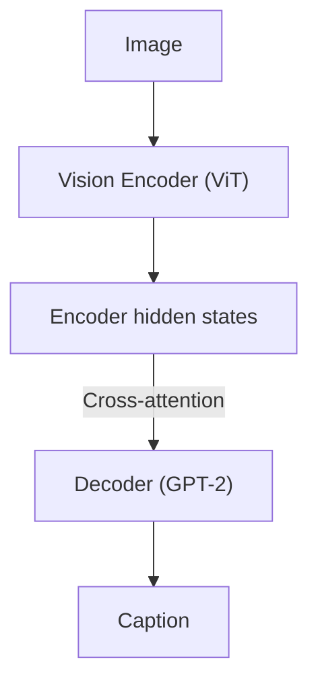
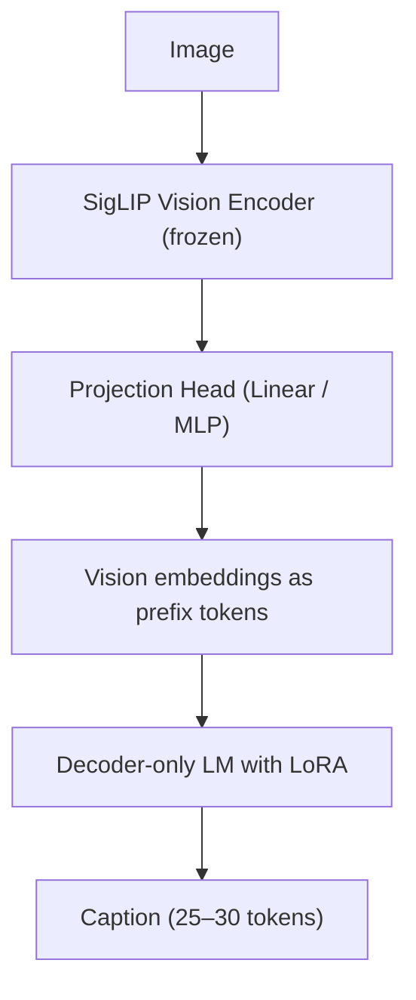

In Part 1, I explained why high-quality alt text matters, how modern
vision–language models can help, and why balanced, carefully curated datasets
are essential for training.

In this second part, I focus on architecture. I explain why I decided to move
away from my initial design, what I learned from that first implementation, and
why I ultimately settled on a prefix-conditioning + LoRA approach.

This choice is driven by practical constraints. For alt-text generation, the
goal is not exhaustive visual understanding, but a short, reliable sentence that
conveys the essence of an image to visually impaired users. Within that scope,
prefix conditioning offers a much simpler model that is easier to train, easier
to deploy, and better aligned with accessibility requirements.

More broadly, the PDF.js alt-text project aims to explore how far we can push
small, efficient vision–language models for accessibility use cases. Rather than
optimizing for peak benchmark scores, the focus is on reliability, fast
iteration cycles, limited compute, and deployable models.

DistilViT is intentionally constrained. Smaller models, fewer trainable
parameters, and simpler architectures make it possible to experiment rapidly,
control bias more carefully through dataset curation, and realistically target
on-device or near-device inference scenarios.

# What I started with: a classic encoder–decoder model

My first implementation relied on Hugging Face’s `VisionEncoderDecoderModel`. Concretely, it paired:

* a ViT-based vision encoder, and
* a GPT-2–style decoder (`distilgpt2`),

trained end-to-end using `Seq2SeqTrainer`.

Conceptually, the architecture looked like this:

This worked. GPT-2 generated captions, and the system was usable. I was inspired by
[The Illustrated Image Captioning Using Transformers](https://ankur3107.github.io/blogs/the-illustrated-image-captioning-using-transformers),
followed that recipe, and reduced the decoder size by using a distilled version of GPT-2.

What I did not fully appreciate at the time was what choosing GPT-2 implied under the hood.

Unlike T5 or BART, GPT-2 is a **decoder-only** language model. In its original architecture, it does not support cross-attention or encoder hidden states.

So why did this setup work?

Because `VisionEncoderDecoderModel.from_encoder_decoder_pretrained()` wraps GPT-2 and injects **cross-attention layers**. This effectively converts GPT-2 into a seq2seq-style decoder by adding encoder–decoder attention blocks and routing the vision encoder outputs through them.

That distinction matters. These cross-attention layers are initialized from scratch, require substantial training signal, and introduce additional state to manage at inference time. Exporting the model and handling caching also become more complex.

This approach is valid, but it turned out to be architecturally heavier than expected for the scale and goals of this project. Training was slower, GPU memory usage was higher, and deployment friction increased.

Models like T5 or BART avoid this injection step because they already contain pretrained cross-attention blocks. However, those blocks were trained to attend to text encoder states and still require fine-tuning to adapt properly to vision features.

At that point, I started looking for an alternative and came across **prefix conditioning**.

# Cross-attention vs prefix conditioning

It is worth stepping back and comparing these two approaches without framing one
as universally superior.

**Cross-attention** gives the decoder continuous access to visual features at
every generation step. This is extremely powerful for tasks that require
fine-grained spatial grounding, OCR, counting, or reasoning over multiple
regions in an image.

**Prefix conditioning**, by contrast, injects visual information once, as a
sequence of projected vision tokens prepended to the text embeddings at the
beginning of the text. After that, the model relies entirely on standard
self-attention.

This leads to clear trade-offs:

* Cross-attention provides stronger and more precise grounding.
* Prefix conditioning trades some of that precision for architectural simplicity.

For my use case, this trade-off is appropriate. The goal of alt text here is not to enumerate details or perform spatial reasoning, but to produce a **single, concise sentence** that conveys the overall content of an image to visually impaired users. Captions are short, factual, and descriptive, and they primarily require global visual context rather than continuous visual querying.

Under these conditions, prefix conditioning is often sufficient, while being far easier to train, debug, and deploy than a full encoder–decoder setup.

# Prefix conditioning with LoRA

The architecture I use now looks like this:

Instead of asking the decoder to attend to an encoder, I inject the visual information directly into the decoder’s input space as prefix tokens.

* No cross-attention
* No encoder–decoder coupling
* Just conditioning

The language model only needs standard causal self-attention. Any decoder-only LLM works out of the box, without architectural changes or special forward signatures.

This restores flexibility. I can swap language models freely without touching the vision side.

I apply **LoRA adapters** to the language model’s attention projection matrices.

* The base language model remains frozen
* The vision encoder remains frozen
* Only the projection head and LoRA adapters are trained

In practice, this means:

* ~221M total parameters
* ~2.2M trainable parameters
* Roughly 1 percent of the model updated

Training is faster, more stable, and far less memory-intensive. The risk of overfitting drops significantly when working with small datasets.

Deployment also becomes simpler.

* The vision encoder exports cleanly to ONNX
* The projection head is trivial
* The decoder is a standard causal LM with past key values

There is no cross-attention graph, no encoder cache plumbing, and no exotic export logic. ONNX Runtime becomes a realistic target instead of a constant source of friction.

# Summary

Cross-attention remains a powerful and sometimes necessary tool. For this project, however, it added complexity without delivering better alt text.

Prefix conditioning gives me:

* a simpler architecture
* faster iteration
* better tooling compatibility
* easier deployment
* freedom to use modern decoder-only models

Initial experiments show that the new architecture produces alt text of
comparable quality to the previous one, with only a 1 to 2 percent CLIP score
difference when trained on the same datasets. The key difference is training
speed, which is roughly five times faster.

Next, my goal is to surpass DistilViT’s current quality by improving the
training dataset, while keeping an architecture that is simple, fast to train,
and flexible enough to accommodate future decoder models.

# References

* Mokady et al., *[ClipCap: CLIP Prefix for Image Captioning](https://arxiv.org/abs/2111.09734)*, 2021
* Li & Liang, *[Prefix-Tuning: Optimizing Continuous Prompts for Generation](https://arxiv.org/abs/2101.00190)*, 2021
* Hu et al., *[LoRA: Low-Rank Adaptation of Large Language Models](https://arxiv.org/abs/2106.09685)*, 2021
* Hugging Face, *[VisionEncoderDecoderModel documentation](https://huggingface.co/docs/transformers/model_doc/vision-encoder-decoder)*

# Useful Links

* [Part 1: Dataset Quality and Bias Detection]({{ '/2025/12/15/better-alt-text-part-1/' | relative_url }})
* [SigLIP on Hugging Face](https://huggingface.co/google/siglip-base-patch16-224)
* [SmolLM on Hugging Face](https://huggingface.co/HuggingFaceTB/SmolLM-135M)
* [DistilViT2 code](https://github.com/tarekziade/distilvit2)
