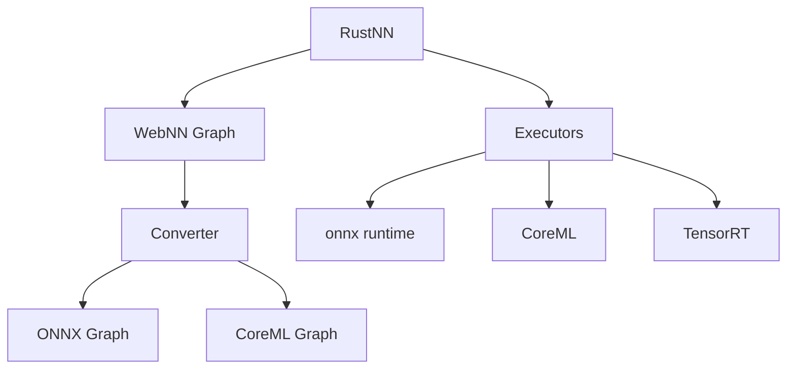
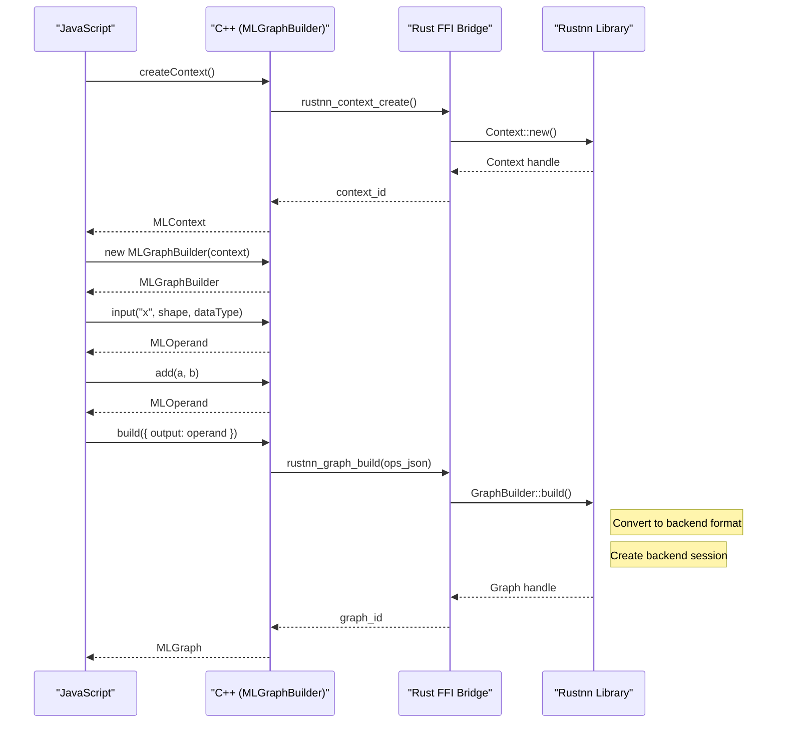
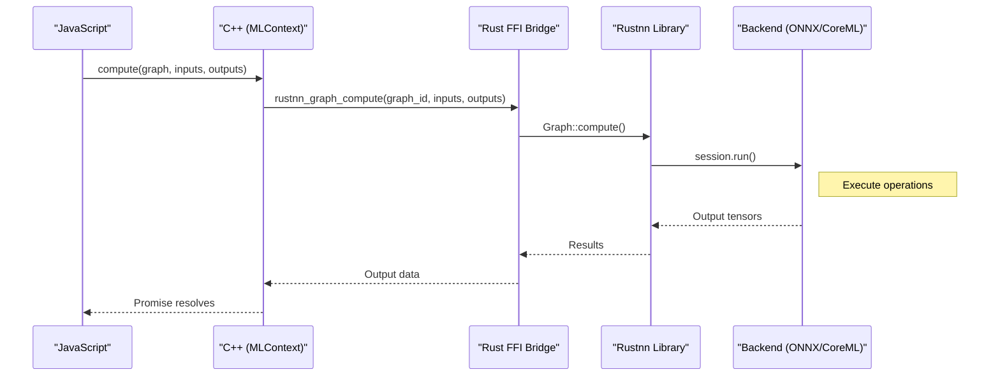

Over the past few weeks, I’ve been working on rustnn, a Rust implementation of
the W3C WebNN specification.

What started as an experiment to gain a deeper understanding of WebNN quickly
grew into something more substantial: a working implementation that is now very
close to being a usable library.

I began this project after returning from TPAC, convinced that WebNN is the
future of AI in the browser, and that Firefox needs to catch up with the work
that has already been done in Chromium.

We are likely still months away from matching the level of maturity Chromium has
achieved over several years of development. However, in just a few weeks I was
able to make significant progress thanks to a few key factors:

- The WebNN specification is clear and well written
- The WPT conformance and validation tests are comprehensive
- End-to-end JavaScript demos exercise WebNN in realistic scenarios
- Chromium’s implementation has already surfaced many of the hard problems


# Claude Code

All of these factors made it surprisingly easy to build the library quickly
using Claude Code. Once I had enumerated the 95 operators that needed to be
implemented, the workflow for each one was essentially the same:

- use the specification to understand the operator
- grab the relevant WPT tests
- implement the operator in the CoreML and ONNX converters
- validate it against the ONNX and CoreML executors
- move on to the next operator

Claude consistently performed well. I was able to build a library that would
normally have taken me months to write on my own. When something failed,
narrowing down the problem was straightforward by iterating between the
specification and the tests.

Because most of the work revolves around graph conversion and orchestrating
existing inference libraries, the code generated by Claude is generally clean
and easy to reason about.

The Chromium implementation was also a huge help when I started to get into 
weird corner cases, especially around CoreML. That code base has been 
developed over the years with people directly involved in the spec.

I have started adding performance tests, and there will likely be some manual
follow-up work, but reaching a functional implementation so quickly is
already a major milestone.

# Why Rust?

These days, adding a new API to Firefox usually means creating a Rust library
that is vendored into the tree and bound to Gecko using cbindgen, unless there
is an existing C++ library that already fits the need.

This gradual “oxidation” of Firefox started years ago, and major features such
as WebGPU have followed this model. Gecko is still a large C++ codebase, and
integrating a Rust library is not trivial, but implementing something like WebNN
outside the browser engine has a major advantage: it allows a much broader
community to contribute. We are already seeing the benefits of this approach
with wgpu.

I am not going to rehash the Rust vs. C++ debate. There is no shortage of
material on why Rust has become an attractive choice for systems programming.

My first instinct was to see whether Chromium’s WebNN implementation could be
reused. In practice, that turned out to be impractical. The code is deeply
intertwined with Blink and its IPC layers, making it very difficult to extract
reusable components in a clean way.

We also evaluated webnn-native, a C++ implementation developed within the Web
Machine Learning community. While promising, the project had been effectively
stalled for about two years and lacked support for the most recent inference
backends. Extending it was an option, but it quickly became clear that a fresh
Rust implementation would be both faster to iterate on and a better
architectural fit for Gecko.

In the end, this is good news for the Web and for WebNN. An independent
implementation helps validate the specification, exposes ambiguities earlier,
and ultimately makes the standard stronger.

Finally, building the core in Rust makes it trivial to expose a Python API on
top of it, which opens the door to experimentation and adoption by the broader
ML community.

# The architecture

rustnn follows a key principle: **graph compilation creates a
platform-independent representation; backend conversion happens at execution
time**.

This follows the same logic as Chromium and is a great way to make sure
we can add more backends in the future.





In the library, we do an initial pass on the WebNN graph to produce an intermediate
representation, then we pick a *converter* to turn that graph into another graph 
that can run with an AI library. And there are *executors* that can run the graph 
using those external libraries.

This is a very powerful design. For instance, I am playing with the TensorRT-RTX 
library that can be used to efficiently run AI on NVIDIA GPUs and that library 
has full support for ONNX graphs. This means we can run networks in rustnn using
the ONNX converter combined with the TensorRT executor.


# CoreML, ONNX and TensorRT

I picked CoreML and ONNX as my first target runtimes because I work on a MacBook,
and because they are both implemented in Chromium.

Chromium uses ONNX on Windows because that library now ships with the latest
Windows 11, and it falls back to DirectML. It also has a CoreML implementation
on macOS.

So I went ahead and built both CoreML and ONNX as converters and executors until
I could make the image classification demo work with the Python binding.

Next, I started to add TensorRT as an executor for Windows with NVIDIA 
GPUs. That one is a work in progress because I have to work on another 
Windows computer and I am slower in that environment. But it's technically 
already working. I started the `trtx-rs` Rust library to bind TensorRT, since the
existing Rust binding was 5 years old.


# PyWebNN 

rustnn exposes a Python binding (PyWebNN) that implements the W3C WebNN API on
top of the Rust core. You can use it for graph validation, conversion
(ONNX/CoreML) and execution of neural networks.

Installation:

```bash
# Install from PyPI with bundled ONNX Runtime (v0.4.0+)
pip install pywebnn

# Or build from source with all backends (ONNX + CoreML)
git clone https://github.com/tarekziade/rustnn.git
cd rustnn
make python-dev
source .venv-webnn/bin/activate
```

Version 0.4.0+ includes bundled ONNX Runtime for immediate execution support.
No additional dependencies needed!

This is a very small example adapted from the repo example examples/python_matmul.py. 

It shows the minimal flow:

1. create an ML instance and context
2. create a graph builder
3. define two constant tensors
4. build a matmul node
5. compile the graph
6. run it

Note: Use `accelerated=False` for CPU-only execution, or `accelerated=True` with `power_preference="high-performance"` for GPU acceleration.

```python
# PyWebNN — tiny matmul example
import numpy as np
import webnn

# 1) create ML instance and context (CPU execution here)
ml = webnn.ML()
ctx = ml.create_context(power_preference="default", accelerated=False)

# 2) build a simple graph: Y = A @ B
builder = ctx.create_graph_builder()
A = np.array([[1., 2.], [3., 4.]], dtype=np.float32)
B = np.array([[5., 6.], [7., 8.]], dtype=np.float32)

a = builder.constant(A)    # constant input A
b = builder.constant(B)    # constant input B
y = builder.matmul(a, b)   # matmul node

graph = builder.build({"output": y})  # compile the graph

# 3) run the graph and print result
result = ctx.compute(graph, {})  # returns dict of outputs
print("Y =", result["output"])
```

What happens:

- ML() creates the entry point following the W3C WebNN spec
- create_context() creates a runtime context (choose CPU/GPU/NPU where supported)
- create_graph_builder() constructs the WebNN graph using familiar ops (constant, matmul, etc.)
- build() compiles the graph with named outputs (dict format)
- compute() runs it and returns the outputs as a dict


# Firefox

Paul Adenot is currently extending the Firefox AI Runtime platform to add
a new specialized process to run against GPUs for the WebSpeech implementation,
and the WebNN API will use it when it's added in the browser.

In the meantime I have built a patch that adds the WebNN JS API in Firefox
and executes it directly in the content process, which is a big security hole.

But it was a good way to start figuring out all the pieces, in particular how
to bind the Rust library into the C++ layer using `cbindgen`, and how to create
the WebIDL interface to provide the JS API.

The current series of patches is just a proof of concept, but I already have
a fully functional demo of all basic operators, and a clone of the WebNN JS
MobileNetV2 image classifier demo — see the video.

<video controls
       style="max-width: 100%; height: auto;"
       poster="/assets/panda.png"
       title="Classifying a panda">
  <source src="https://cotedorclassicjuniors.fr/webnn-demo.mov" type="video/quicktime">
  Your browser does not support the video tag.
  <a href="https://cotedorclassicjuniors.fr/webnn-demo.mov">Download the video</a> instead.
</video>

The WebNN implementation spans six distinct layers:

1. **JavaScript API Layer** — Web-facing API (`navigator.ml`, `MLContext`, `MLGraphBuilder`, `MLGraph`, `MLOperand`, `MLTensor`)
2. **WebIDL Layer** — Interface definition language defining the JavaScript API surface
3. **C++ DOM Implementation** — Core implementation in `dom/webnn/`
4. **Rust FFI Bridge** — Foreign Function Interface in `dom/webnn/rustnn_bridge/`
5. **rustnn Library** — Rust implementation in `third_party/rust/rustnn/`
6. **Backend** — Platform-specific backend (ONNX Runtime, CoreML, etc.) for neural network execution with hardware acceleration


... and has the following flow:

Graph Building Phase:

- Web content calls navigator.ml.createContext()
- C++ creates backend context via Rust FFI (ONNX Runtime or CoreML depending on platform)
- Web content creates MLGraphBuilder and defines operations
- Each operation creates an MLOperand representing the result
- Web content calls builder.build() with output operands
- C++ serializes operations to JSON and calls Rust FFI
- Rustnn converts the graph to backend-specific format (ONNX or CoreML)
- Backend creates an optimized execution session
- Graph ID is returned to web content as MLGraph




Inference Phase:

- Web content calls context.compute(graph, inputs, outputs)
- C++ marshals input data and calls Rust FFI with graph ID
- Rustnn retrieves the backend session and prepares input tensors
- Backend (ONNX Runtime or CoreML) executes the computational graph
- Hardware acceleration is automatically utilized when available
- Output tensors are returned through Rust FFI
- C++ copies output data to JavaScript-provided buffers
- Promise resolves, indicating inference completion





Again, this is not the final design since we need to run inference in a
separate process and have an IPC layer between the C++ code and the Rust bridge.


# Conclusion


rustnn started as a way for me to really understand WebNN, but it quickly turned
into a convincing proof that the specification is solid, implementable, and
ready to grow beyond a single browser engine. Having an independent
implementation is healthy for the Web, and rustnn shows that WebNN can be built
as a reusable, backend-agnostic library rather than something deeply tied to a
single browser architecture.

This project is also my first substantial experience with Claude Code, and it
fundamentally changed the pace at which I could work. Implementing nearly a
hundred operators, wiring multiple backends, and validating everything against
WPT would normally be a multi-month effort. With a strong spec, good tests, and
a capable AI agent, it became an iterative and surprisingly enjoyable process.
The result is not throwaway code, but a clean foundation that can be extended,
optimized, and reviewed by others.

I am very optimistic about WebNN’s future in Firefox and on the Web in general.
With rustnn and pywebnn, my hope is to make it easier for browser engineers, ML
practitioners, and researchers to experiment, contribute, and push the ecosystem
forward. There is still a lot to do, especially around performance, security,
and process isolation, but the path forward is now much clearer.


# Resources

- [GitHub Repository](https://github.com/tarekziade/rustnn)
- [PyPI Package](https://pypi.org/project/pywebnn/)
- [W3C WebNN Specification](https://www.w3.org/TR/webnn/)
- [Firefox Integration Bug](https://bugzilla.mozilla.org/show_bug.cgi?id=2005145)
- [rustnn Documentation](https://tarekziade.github.io/rustnn/)
- [Firefox POC patch](https://bugzilla.mozilla.org/show_bug.cgi?id=2005145)
- [TensorRT Rust lib](https://github.com/tarekziade/trtx-rs)
- [Firefox Video Demo](https://cotedorclassicjuniors.fr/webnn-demo.mov)
- [Legacy WebNN native](https://github.com/webmachinelearning/webnn-native)


